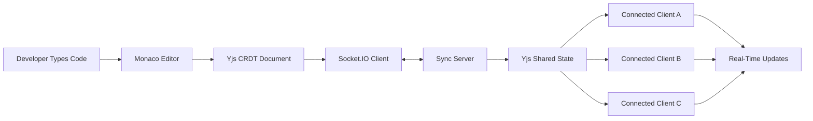
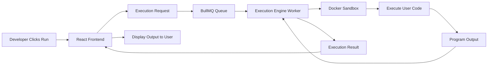

# ⚡ Tessera.io: The Collaborative Developer Sandbox

[](https://opensource.org/licenses/MIT)
[](http://makeapullrequest.com)
[](https://www.typescriptlang.org/)

**Tessera.io** is an open-source, real-time collaborative IDE engine. It provides the raw infrastructure needed to build next-generation development tools: zero-latency CRDT document synchronization, a secure remote code execution environment, and an architecture designed natively for AI integration.

Standard cloud IDEs are built for humans. Tessera.io is built for the future: a secure arena where human developers and AI agents can write, test, and debug code together in real time.

---

## Table of Contents

- [🚀 Current State: The MVP](#-current-state-the-mvp)
- [🌐 Supported Languages](#-supported-languages)
- [🏗️ Architecture & Monorepo Structure](#%EF%B8%8F-architecture--monorepo-structure)
- [🛠️ Local Development Setup](#%EF%B8%8F-local-development-setup)
- [🗺️ Roadmap & Future Plans](#%EF%B8%8F-roadmap--future-plans)
- [🤝 Contributing](#-contributing)
- [📄 License](#-license)

---

## 🚀 Current State: The MVP

The current repository is the foundational MVP. We have established the core plumbing to allow real-time collaborative typing and remote code execution. 

*   **Real-Time Collaboration:** Powered by Yjs (CRDTs) and Socket.io, ensuring deterministic, conflict-free state resolution across clients.
*   **The Editor:** React + TailwindCSS utilizing `@monaco-editor/react` for a native VS Code-like typing experience.
*   **Secure Execution Engine:** A Node.js worker utilizing BullMQ and the Docker Engine API to run untrusted code safely in isolated, ephemeral containers (with optional gVisor support).
*   **AI Service Foundation:** A lightweight Python/FastAPI service hooked into the Model Context Protocol (MCP) and MongoDB Atlas Vector Search for RAG pipelines.

---

## 🌐 Supported Languages

Tessera.io currently supports the following languages in the collaborative editor:

| Language   | Monaco Mapping | Execution Sandbox | IntelliSense |
|------------|---------------|-------------------|--------------|
| TypeScript | `typescript`  | ✅ Supported      | ✅ Built-in  |
| Python     | `python`      | ✅ Supported      | 🔧 In Progress |
| C++        | `cpp`         | ✅ Supported      | 🔧 In Progress |

> Want to add a new language? See the [Adding a New Language](CONTRIBUTING.md#adding-a-new-language) guide.

---

## 🏗️ Architecture & Monorepo Structure

Tessera.io uses a strict **Turborepo** monorepo via npm workspaces. This modular design allows open-source contributors to work on the exact layer they specialize in without needing to understand the entire stack.

```text
Tessera.io/
├── apps/
│   ├── web/                # React, Vite, Monaco Editor client
│   ├── sync-server/        # Node.js, Express, Socket.io, Yjs backend
│   ├── execution-engine/   # Node.js, BullMQ worker, Docker API sandbox
│   └── ai-service/         # Python, FastAPI microservice
└── packages/
    ├── shared-types/       # Common TypeScript definitions and DTOs
    ├── collaboration/      # Shared CRDT utilities and types
    └── ui-components/      # Reusable UI component library
```

---
### 🔄 System Interaction Overview

The following diagrams illustrate the two primary workflows within Tessera.io:

- Real-time collaborative editing powered by Monaco Editor, Yjs, and Socket.IO.
- Secure remote code execution powered by BullMQ and Docker sandboxes.

---

### 🤝 Real-Time Collaboration Flow



**Flow Explanation**

1. A developer edits code inside the Monaco Editor.
2. Changes are stored in a Yjs CRDT document.
3. Updates are synchronized through Socket.IO.
4. The Sync Server distributes CRDT updates.
5. Connected clients receive changes in real time.
6. Conflict-free synchronization is maintained across all participants.

---

### ⚙️ Secure Code Execution Flow



**Flow Explanation**

1. The developer submits code for execution.
2. The frontend sends an execution request.
3. BullMQ queues the job for processing.
4. The Execution Engine picks up the job.
5. Code runs inside an isolated Docker sandbox.
6. Output is captured and returned safely.
7. Results are displayed back to the user.

> These workflows represent the core foundation of Tessera.io's collaborative development and secure execution architecture.

## 🛠️ Local Development Setup

### Prerequisites

Before starting, install the tools for your operating system:

* **Node.js** ≥ 20.0.0 and **npm** ≥ 10.0.0
* **Docker** or **Docker Desktop** (for the execution engine)
* **Redis** (for BullMQ task queues; a Docker container is fine)
* **MongoDB** (for AI service RAG storage; a Docker container is fine)
* **Python** ≥ 3.11 (for the AI microservice)

*Optional:*
* **gVisor** (`runsc`) for enhanced kernel isolation in the execution engine.

If the execution engine cannot reach Docker, hits WSL mount errors, or leaves behind interrupted sandbox containers, see the [Docker Sandbox Troubleshooting](docs/docker-sandbox-troubleshooting.md) guide.

### Clone and install

1. **Clone the repository:**
```bash
git clone https://github.com/Kushaal-k/Tessera.io.git
cd Tessera.io
```

The README defaults to HTTPS because it works without SSH key setup. If you prefer SSH and have keys configured, use `git clone git@github.com:Kushaal-k/Tessera.io.git` instead. If you are contributing from a fork, replace the clone URL with your fork's SSH or HTTPS URL.

2. **Install all workspace dependencies:**
```bash
npm install
```

3. **Create your local environment file:**
```bash
cp .env.example .env
```

On Windows PowerShell:
```powershell
Copy-Item .env.example .env
```

### Linux setup

1. **Verify Node.js, npm, Docker, and Python:**
```bash
node --version
npm --version
docker version
python3 --version
```

2. **Start Docker if it is not already running:**

On systemd-based Linux distributions:
```bash
sudo systemctl start docker
```

On non-systemd distributions or WSL setups that use the Docker service script:
```bash
sudo service docker start
```

If neither command applies, follow your distribution's Docker startup instructions.

3. **Start infrastructure services (Redis and MongoDB):**
```bash
# Start Redis and MongoDB together using Docker Compose
docker compose up -d
```

If containers already exist from a previous run:
```bash
docker compose start
```

4. **Set up the Python AI service:**
```bash
cd apps/ai-service
python3 -m venv .venv
source .venv/bin/activate
pip install -r requirements.txt
cd ../..
```

5. **Start all services in development mode:**
```bash
npm run dev
```

### Windows setup

For the smoothest Windows experience, use Windows 11, PowerShell, and Docker Desktop with the WSL 2 backend enabled.

1. **Verify Node.js, npm, Docker Desktop, and Python:**
```powershell
node --version
npm --version
docker version
python --version

```

2. **Start infrastructure services (Redis and MongoDB):**
```powershell
# Start Redis and MongoDB together using Docker Compose
docker compose up -d
```

If containers already exist from a previous run:
```powershell
docker compose start
```

3. **Set up the Python AI service:**
```powershell
cd apps/ai-service
python -m venv .venv
.\.venv\Scripts\Activate.ps1
pip install -r requirements.txt
cd ..\..
```

If PowerShell blocks virtual environment activation, allow scripts for the current PowerShell session only:
```powershell
Set-ExecutionPolicy -Scope Process -ExecutionPolicy Bypass
```

Then run the activation command again. This setting expires when the PowerShell window closes.

4. **Start all services in development mode:**
```powershell
npm run dev
```

### Verify your setup

Run these checks from the repository root before opening a pull request. The same commands work in Bash, PowerShell, or CMD:

```text
npm run typecheck
npm run build
```

Then start the development stack as a manual smoke test:

```bash
npm run dev
```

This command stays running while the services are active. When it is running, confirm the local services use the expected defaults:

* Redis is reachable on `localhost:6379`
* MongoDB is reachable on `localhost:27017`
* The sync server uses `PORT=4000`
* The frontend origin is `http://localhost:3000`

`npm run dev` concurrently starts the React frontend, the Socket.io sync server, the FastAPI service, and the BullMQ execution worker via Turborepo.


## 🗺️ Roadmap & Future Plans

We are actively building out the next phases of Tessera.io. If you are looking to contribute, these are our major upcoming milestones:

### 🎓 Phase 2: The "Socratic Mentor" AI Layer

To combat the rise of "vibe coding" (where developers blindly copy-paste AI code), we are building a deeply integrated, learning-focused AI mode.

* **Interactive Scaffolding:** The AI will refuse to write complete solutions. Instead, it will generate code skeletons with missing logic gates and interactive `// TODO` comments via the CRDT stream.
* **Live Runtime Interrogation:** When code fails in the Docker sandbox, the AI will intercept the logs and ask the user guiding questions about their variables rather than just printing the fix.

### 🌐 Phase 3: Integrated WebRTC

* Adding an A/V Selective Forwarding Unit (SFU) to enable seamless audio and video conferencing directly inside the collaborative workspace.
* Interactive multi-player whiteboard integration synced alongside the Monaco editor.

### 🐙 Phase 4: GitHub Integration

* Native OAuth GitHub app integration to fetch repositories, map file trees, and sync PRs and Issues directly into the workspace.

---

## 🤝 Contributing

Tessera.io is an early-stage open-source project, and we are aggressively looking for contributors! Whether you are a React developer, a DevOps engineer (Docker/gVisor), or an AI researcher, there is a place for you here.

1. Fork the repository
2. Create a feature branch: `git checkout -b feature/my-feature`
3. Make changes in the relevant workspace(s)
4. Run `npm run typecheck` and `npm run build` from the root
5. Submit a pull request

Please read our [CONTRIBUTING.md](CONTRIBUTING.md) for details on our code of conduct, and the process for submitting pull requests to us. Look for issues tagged `good first issue` to get your feet wet.

## 📄 License

This project is licensed under the MIT License - see the [LICENSE](LICENSE) file for details.
